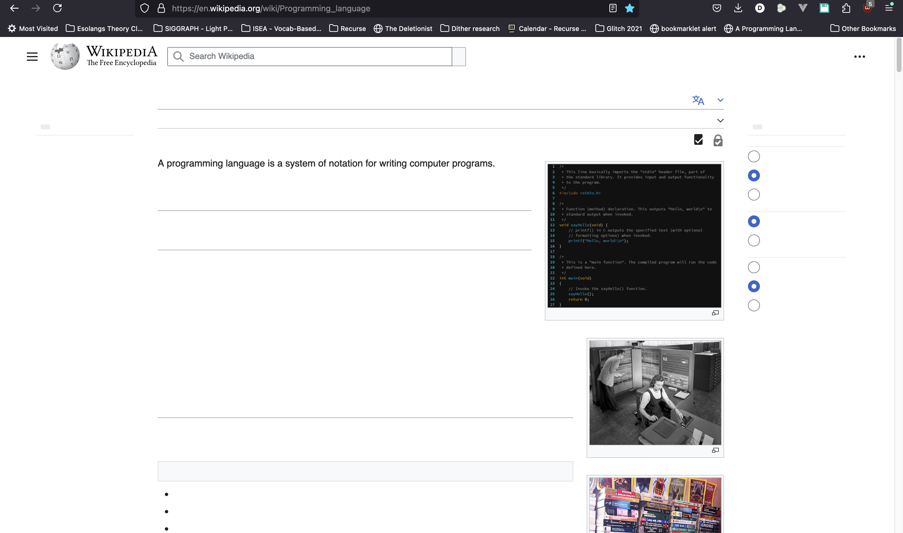
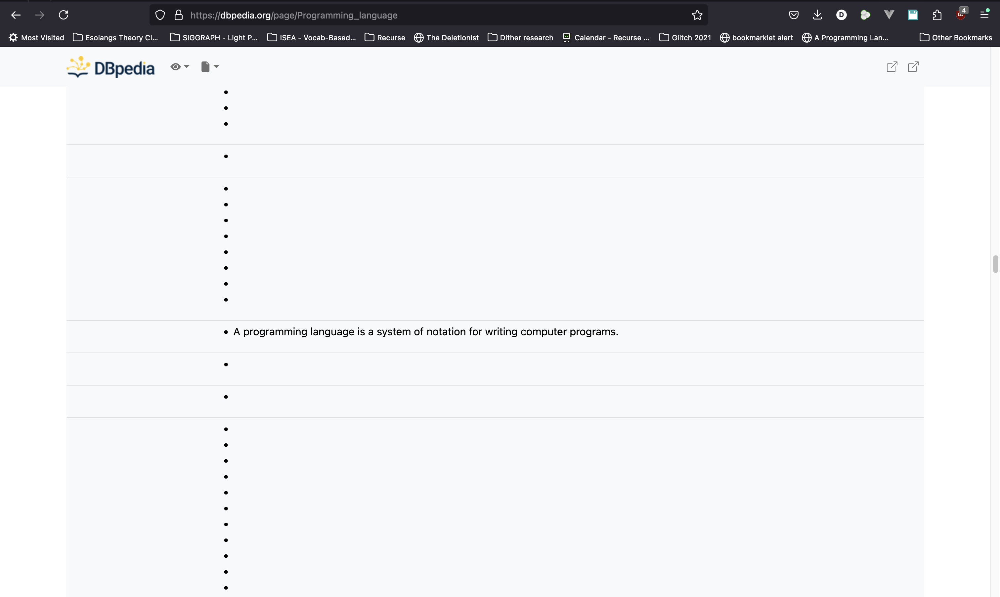

# A programming language is a system of notation for writing computer programs. Bookmarklet

`proglang.js` is a simple bookmarklet to run **A programming language is a system of notation for writing computer programs.** programs. Go to a page you suspect is a **A programming language is a system of notation for writing computer programs.** program and run the bookmarklet. All text will be wiped out apart from the program's output.

Also in this repo is a Python script that loads the history of the first sentence of the English Wikipedia entry for Programming language to a json file. It also updates the js code with the most recent version. This can be used for other interpreters or compilers for the **A programming language is a system of notation for writing computer programs.** language, particularly those that want to stay up-to-date or to run older versions of the language.

More at the <a href="https://danieltemkin.com/Esolangs/AProgrammingLanguage/">A Programming Language Is... homepage</a>.

See also: the <a href="https://esolangs.org/wiki/A_programming_language_is_a_system_of_notation_for_writing_computer_programs.">esolangs wiki</a>

## Contents

* `proglang.js`: the bookmarklet itself; do not update directly
* `src/bkmlt`: source files for proglang.js. Use grunt to combine and minimalize into `proglang.js`. Main content is in `program.js`
* `src/wiki_update/sentences.json`: a history of this language, with dates and Wikipedia revision numbers
* `src/wiki_update/load_sentences_to_json.py`: loads sentences.json from Wikipedia
* `newest_sentence_to_js.py`: updates bookmarklet with latest entry from sentences.json

## In Action

